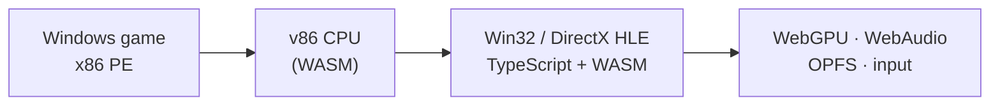

# Orthros

**Run classic Windows games in your browser.**

Orthros runs real x86 Windows games in the browser — no OS image, no plugins, no
server round-trip. It loads a game's PE executable directly and reimplements Windows
itself (Win32, COM, DirectDraw / Direct3D 3–9, DirectSound) on top of WebGPU, WebAudio
and OPFS.

[Compatibility](docs/compatibility.md) · [Documentation](#documentation) · [Contributing](CONTRIBUTING.md)

<!-- TODO: hero.gif — a short montage (Max Payne / NFS Underground / StarCraft / Unreal) -->

- Real x86 Windows executables — not source ports
- DirectDraw & Direct3D 3–9 → WebGPU
- DirectSound & `waveOut` → WebAudio
- Runs entirely on the client — no game streaming, no server-side execution

> ⚠️ Early and actively developed — expect rough edges.

## Games running today

Orthros already runs a range of late-90s / early-2000s titles into gameplay, including
Re-Volt, Heroes of Might & Magic III, StarCraft / Brood War, Diablo II, Max Payne, The Elder
Scrolls III: Morrowind, Harry Potter and the Philosopher's Stone, Need for Speed: Porsche
Unleashed & Underground, Unreal Gold, Command & Conquer: Tiberian Sun, Discworld Noir, Tomb
Raider II and Tony Hawk's Pro Skater 2. See the [full compatibility list](docs/compatibility.md)
for exact status per title.

Several of these are sold DRM-free on **GOG** (Heroes III, Re-Volt, Morrowind, Unreal Gold,
Tomb Raider II…) — you can drop the offline installer straight in. Because only **demos and
freeware** are legally redistributable, the online library lets you play those instantly;
everything else, you bring your own legally-owned copy.

Orthros has no public deployment yet — see [Run locally](#run-locally).

## Why

The web has great open emulators for old platforms — DOSBox, ScummVM, Dolphin. But the
awkward middle — **native Win32 games from ~1997–2004** with no source port, not on modern
stores, and fussy on current Windows — has no easy home. Orthros aims squarely at that gap.

It gives those games a browser-native runtime without booting a Windows image or a native
install. **We ship the emulator, not the games:** the online library is demos, shareware and
other redistributable releases; you import your own legally-owned files locally.

## How it works

Orthros doesn't boot Windows. It loads the game's PE executable into a 4 GB guest address
space, runs its x86 code through a fork of [v86](https://github.com/copy/v86), and intercepts
every imported Win32 and DirectX call.



- Win32 / COM APIs are reimplemented in TypeScript and WASM.
- DirectDraw and Direct3D 3–9 are translated to WebGPU / WGSL in real time.
- DirectSound and `waveOut` mix in an AudioWorklet over a SharedArrayBuffer ring.
- Game files, saves and registry live in an OPFS virtual filesystem (read-only ROM plus a
  copy-on-write overlay).
- Hot guest/host calls stay entirely inside WASM for speed.
- A bounded profile-guided Tier-2 JIT coalesces genuinely hot cross-module paths
  into one WASM compilation unit instead of blindly growing cold control flow.
- Saturated Tier-2 sets keep sparse successor profiles across phase changes, and
  cold WebAssembly compilation uses a bounded two-module window instead of one
  globally serialized Promise.

[Read the architecture guide →](docs/architecture.md)

## Run locally

Requirements: [Bun](https://bun.sh/), and a browser with WebGPU (Chrome / Edge 113+) and
SharedArrayBuffer.

```bash
git clone <repo-url>
cd orthros
bun install
bun run dev
```

Open <http://localhost:5174>.

[Development & self-hosting guide →](docs/development.md)

## Import your own games

Orthros can load:

- `.wgb` game bundles;
- raw game folders (drag & drop);
- supported GOG Inno Setup installers (extracted in-browser).

Imported files are processed locally in the browser and stored in OPFS, with a read-only base
image and a writable overlay for saves and configuration.

```bash
bun tools/make-wgb.ts <game-dir> <out.wgb> --exe game.exe
```

[Game import guide →](docs/bundles.md) · [GOG import →](docs/gog-import.md)

## Help preserve a game

Orthros is built around compatibility work: load a game, find the generic Win32 or DirectX
gap, implement it faithfully, and prove the fix with the automation harness — a fix that helps
every title on the same code path, never a per-game hack.

Coding-agent-assisted contributions are welcome, as long as fixes stay generic, reviewable and
covered by reproducible harness tests.

- Report a working or broken game
- Diagnose a missing API (`report()` / `stubs()` name the culprit)
- Submit a verified, generic implementation

[Contributing guide →](CONTRIBUTING.md) · [Contributing with coding agents →](docs/contributing-with-ai.md)

## Community & contact

- Questions, ideas, or a game you got running → [GitHub Discussions](https://github.com/Lomchat/orthros/discussions).
- Bugs & compatibility reports → [Issues](https://github.com/Lomchat/orthros/issues) (use the templates).
- Security → [SECURITY.md](SECURITY.md) (private reporting).
- Anything else, including takedown / legal → open an issue.

## Documentation

- [Architecture](docs/architecture.md) — how the engine fits together
- [Compatibility](docs/compatibility.md) — tested titles and their status
- [Importing games](docs/bundles.md) · [GOG import](docs/gog-import.md)
- [Development & self-hosting](docs/development.md)
- [Automation harness](docs/harness.md) — driving and observing games
- [Contributing with coding agents](docs/contributing-with-ai.md)

## License & acknowledgements

Orthros is licensed under [Apache-2.0](LICENSE).

**Orthros is a fork of [BottleShip](https://github.com/jenissimo/bottleship) by Eugeniy
Smirnov (jenissimo), used under the Apache License 2.0.** The files in this repository have
been modified from the upstream project. Notable changes so far:

- a browser runtime and performance track targeting *The Battle for Middle-earth*;
- v86 JIT work — inline current-module indirect dispatch (on by default) and guarded direct
  block chaining;
- Direct3D 9 fast paths — direct present on desktop GPUs, fast surface-texture locks;
- a trap-free game clock and hot guest loops offloaded to WASM.

See the git history for the complete list.

It builds on a fork of [v86](https://github.com/copy/v86) (BSD-2) and bundles other
open-source components (SeaBIOS / VGA BIOS, an FFmpeg-based decoder, fonts) — their licenses
and notices are in [THIRD-PARTY-NOTICES.md](THIRD-PARTY-NOTICES.md).

**Orthros does not distribute commercial game files.** Bring your own legally-owned copies.
